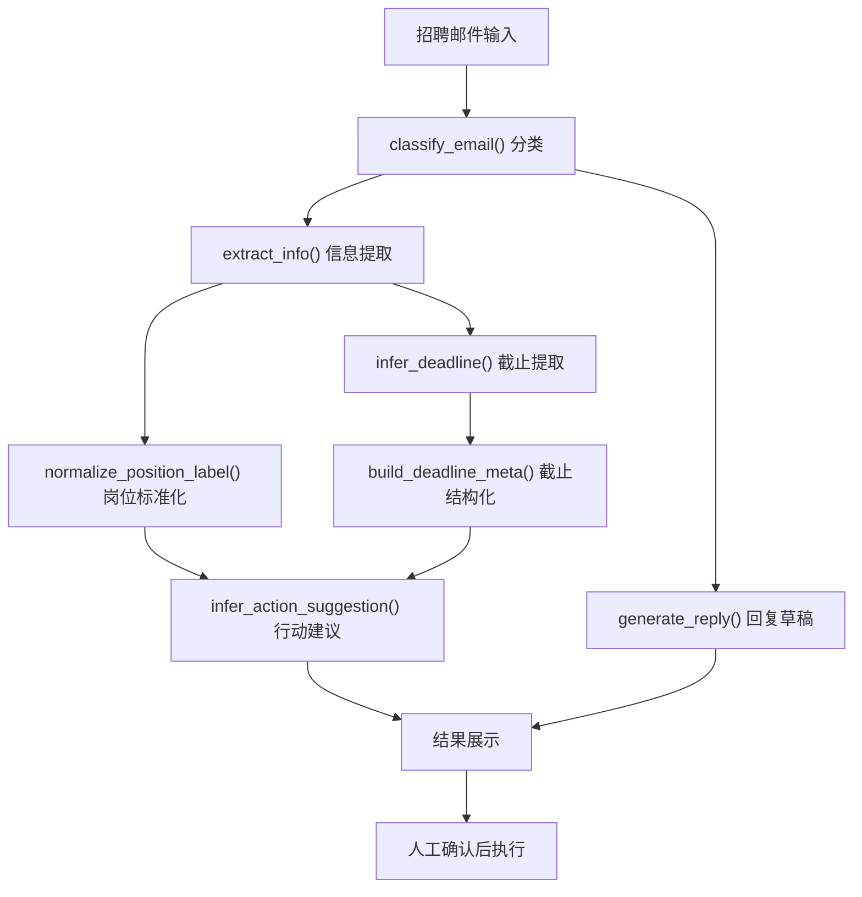

# JobMail AI - PRD Lite（V1）

文档版本：v1.0  
更新时间：2026-04-16  
文档类型：轻量产品需求文档（投递/面试版）

## 1. 背景与目标

在实习和校招场景中，候选人会同时推进多个岗位，招聘邮件类型复杂且密集。用户经常遇到三类问题：
- 无法快速判断邮件类型与优先级
- 容易漏掉截止时间和待办动作
- 回复措辞准备耗时，难以保证效率

`JobMail AI` 的目标是提供一个“可解释、可评估、可人工确认”的邮件处理原型，帮助用户更快完成求职沟通闭环。

## 2. 目标用户与使用场景

目标用户：
- 同时投递多家公司岗位的本科/研究生
- 处于实习或校招阶段、邮件量较大的候选人

核心场景：
- 收到面试邀请后快速确认安排
- 收到补件要求后整理并按时提交材料
- 收到 Offer 沟通后确认到岗与联系方式
- 收到进度通知后判断是否需要立即跟进

## 3. 产品范围（V1）

### 3.1 In Scope

- 招聘邮件分类（6类）：
  - `interview`
  - `materials`
  - `follow_up`
  - `offer`
  - `rejection`
  - `spam`
- 关键信息提取：
  - 日期、时间、联系方式、待办句
  - `position_raw` + `position`（标准化）
  - `deadline_raw` + `deadline_iso` + `deadline_status` + `deadline_hours_left`
- 动作建议：
  - 基于邮件类型 + 截止紧急度生成建议
- 回复草稿：
  - 面试、补件、Offer 场景模板化生成
- 评估机制：
  - strict/loose 指标计算与错例导出

### 3.2 Out of Scope

- 自动发信
- 实时邮箱生产级接入与稳定性保障
- 复杂多 Agent 编排

## 4. 核心流程



## 5. 功能需求（按模块）

### FR-1 邮件分类

输入：邮件 `subject/body/sender`  
输出：`type/priority/sender_type`

规则要求：
- 垃圾邮件优先拦截
- 面试、补件、进度、Offer、拒信按关键词打分分类
- 输出统一类别用于后续提取与建议

### FR-2 信息提取

输入：邮件正文与分类结果  
输出：结构化字段字典

要求：
- 提取中英文日期时间表达
- 提取手机号、邮箱、待办句
- 输出去重后的 `dates/times`

### FR-3 岗位标准化

输入：岗位原文 `position_raw`  
输出：标准岗位标签 `position`

要求：
- 同义岗位归一化，便于统计和评估
- 垃圾邮件默认 `未知岗位`

### FR-4 截止时间结构化

输入：`deadline_raw + 邮件时间基准`  
输出：`deadline_iso/deadline_status/deadline_hours_left/deadline_is_relative`

要求：
- 支持绝对时间（如 `Apr 19, 11:59 PM`、`4 月 18 日 18:00`）
- 支持相对时间（如 `下周二`、`within five business days`）
- 给出紧急度标签：`overdue/urgent/soon/normal/unknown`

### FR-5 动作建议与回复草稿

输入：分类结果 + 提取结果  
输出：`action_suggestion` 与 `reply draft`

要求：
- 动作建议随截止紧急度动态变化
- `spam` 不生成回复草稿
- 其他类型按语言与模板生成可编辑回复

## 6. 非功能要求与边界

### 6.1 安全边界

- 默认不自动发信
- 所有建议结果需人工确认后执行

### 6.2 可解释性

- 保留 `position_raw`、`deadline_raw`
- 输出 `deadline_iso` 与 `deadline_status`，便于人工复核

### 6.3 可复现性

- 提供固定样本与 gold 标注文件
- 提供可直接运行的评估脚本

## 7. 指标与验收

评估命令：

```bash
python evaluate.py
```

V1 指标（当前样本 n=12）：
- `classification_acc_strict = 1.0`
- `position_acc_strict = 1.0`
- `position_acc_loose = 1.0`
- `deadline_acc_strict = 1.0`
- `deadline_acc_loose = 1.0`
- `full_match_acc_strict = 1.0`
- `full_match_acc_loose = 1.0`
- `mismatch_count = 0`

验收标准（V1）：
- 主流程可跑通并输出结构化结果
- 可生成动作建议与回复草稿
- 评估脚本可稳定输出指标与错例文件

## 8. 风险与后续计划

主要风险：
- 小样本评估结果偏乐观
- 规则法对非常规表达鲁棒性有限

下一步（V1.1）：
1. 扩展到 50+ 匿名样本做独立验证
2. 增加规则版 vs LLM 版对比评估
3. 增加轻量展示页（Streamlit）用于面试演示

## 9. 相关文件

- 核心脚本：`demo.py`
- 评估脚本：`evaluate.py`
- 样本数据：`data/jobmail_samples.json`
- 标注数据：`data/jobmail_eval_gold.json`
- 指标输出：`output/reports/evaluation_metrics.json`
