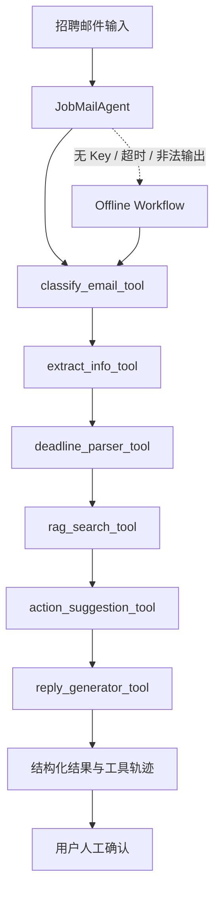

# JobPilot AI · 智能求职邮件助手

JobPilot AI 是一个面向学生和早期求职者的招聘邮件处理 Agent。系统使用单 Agent 调度邮件分类、信息抽取、截止时间解析、本地知识检索、行动建议和回复草稿工具，并在模型不可用时自动切换到离线工作流。

项目重点不是自动发信，而是把非结构化招聘邮件转换为可复核、可执行的求职信息：

- 判断邮件类型和优先级
- 提取公司、岗位、截止时间、联系方式和待办事项
- 从本地求职知识库检索沟通规范
- 生成行动建议和可编辑回复草稿
- 展示工具调用轨迹、检索来源和降级状态
- 强制保留人工确认，不自动发送邮件

## 架构设计



### 两种运行模式

| 模式 | 触发条件 | 行为 |
| --- | --- | --- |
| `llm_agent` | API Key、模型名和接口配置完整 | LLM 在限定步数内选择工具，并基于 RAG 内容生成回复草稿 |
| `offline_workflow` | 未配置模型、主动选择离线模式或 LLM 调用失败 | 使用确定性工具链完成分类、抽取、检索、建议和模板草稿 |

两种模式返回相同的 V2 结果结构，并明确记录 `mode`、`fallback`、`retrieval`、`human_review` 和 `trace`。工具轨迹只展示工具名、输入摘要和执行结果，不展示模型隐藏推理。

## 主要能力

- **单 Agent 编排**：最多执行 8 步，防止无限工具调用和过早结束
- **结构化工具调用**：使用 JSON Schema 描述 7 个工具的输入输出
- **本地轻量 RAG**：使用 TF-IDF 和类型/语言元数据检索 5 类求职沟通规范
- **可解释时间处理**：保留 `deadline_raw`，同时输出标准化时间、剩余小时和紧急度
- **可靠降级**：缺少配置、API 超时、非法 JSON 或工具路径不完整时自动运行离线流程
- **Human-in-the-loop**：Offer、未知岗位、未知 deadline 和检索失败会产生人工复核提示
- **可视化 Demo**：支持内置样本和自定义邮件，展示结构化分析、回复、RAG 来源和执行轨迹

## 快速开始

建议使用 Python 3.10+。

```bash
python3 -m pip install -r requirements.txt
```

不配置 API 也可以直接运行离线 Demo：

```bash
streamlit run app.py
```

也可以启动本地 FastAPI 服务：

```bash
uvicorn api:app --reload
```

常用 API：

```bash
curl http://127.0.0.1:8000/health

curl -X POST http://127.0.0.1:8000/analyze_email \
  -H "Content-Type: application/json" \
  -d '{
    "subject": "AI 产品实习生面试邀请",
    "sender": "hr@example.com",
    "date": "2026-04-15 09:10:00",
    "body": "请于 4 月 16 日 18:00 前回复是否参加视频面试。",
    "force_offline": true
  }'

curl -X POST http://127.0.0.1:8000/evaluate_quality
curl http://127.0.0.1:8000/runs
```

API 运行记录会写入本地 SQLite：`data/jobpilot_runs.sqlite3`。数据库只保存演示输入、结构化结果、评测指标和 badcase 摘要，不保存 API Key 或真实邮箱凭据。

Docker 本地运行：

```bash
docker build -t jobpilot-ai .
docker run --rm -p 8000:8000 jobpilot-ai
```

如需运行真实 LLM Agent，复制环境变量模板并填入自己的配置：

```bash
cp .env.example .env
export JOBMAIL_AI_API_KEY="your-api-key"
export JOBMAIL_AI_MODEL="your-model-name"
export JOBMAIL_AI_BASE_URL="https://api.openai.com/v1"
streamlit run app.py
```

`.env` 已加入 `.gitignore`。项目不会把 API Key 写入代码、日志或 Agent 执行轨迹。

也可以运行原始 V1 命令行 Demo：

```bash
python3 demo.py
```

## V2 输出示例

```json
{
  "schema_version": "2.0",
  "mode": "offline_workflow",
  "fallback": {
    "used": true,
    "reason": "LLM configuration is incomplete"
  },
  "classification": {
    "type": "interview",
    "priority": "high"
  },
  "extracted_info": {
    "position": "AI Product Intern",
    "deadline_raw": "4 月 16 日 18:00",
    "deadline_iso": "2026-04-16 18:00",
    "deadline_status": "soon"
  },
  "retrieval": {
    "query_type": "interview",
    "hits": [
      {
        "source": "interview_reply.md",
        "type": "interview"
      }
    ]
  },
  "human_review": {
    "required": true,
    "confirmed": false
  }
}
```

## 测试与评估

运行自动化测试：

```bash
python3 -m pytest -q
```

运行 V1 回归评估：

```bash
python3 evaluate.py
```

运行 V2 路由、RAG、结构化输出和降级评估：

```bash
python3 evaluate_agent.py
```

运行扩展 LLM 应用质量评测：

```bash
python evaluate_quality.py
```

该脚本读取 `data/jobmail_eval_set_v2.json` 中的 60 条匿名/仿真邮件样本，输出：

- `output/reports/eval_quality_metrics.json`
- `output/reports/badcase_report.csv`
- `docs/EVALUATION_REPORT.md`

评测指标覆盖分类准确率、岗位字段匹配率、deadline 解析准确率、结构化输出合法率、RAG Top-1 类型命中率、回复安全通过率和 badcase 类型分布。

当前本地验证结果：

```text
V1 labeled samples:                 12
V1 full_match_acc_strict:           1.0
V2 task_completion_rate:            1.0
V2 structured_output_valid_rate:    1.0
V2 tool_route_pass_rate:             1.0
V2 retrieval_top1_type_accuracy:    1.0
V2 reply_safety_pass_rate:           1.0
V2 llm_failure_fallback_success:    1
```

以上结果基于 12 条小规模演示样本，用于验证 MVP 流程，不代表生产级准确率。7 条自动化测试还使用脚本化 LLM 客户端验证完整工具调用循环和过早结束降级，避免在测试中产生外部 API 费用。

扩展评测集用于展示 AI 应用评测方法，包括标签体系、结构化字段、测试集、回归测试、badcase 归因和评测报告输出。该数据集仍为演示级样本，不代表真实业务生产效果。

当前扩展评测结果：

```text
Extended evaluation samples:       60
Classification accuracy:           0.95
Position match rate:               1.0
Deadline ISO accuracy:             0.9333
Structured output valid rate:      1.0
RAG Top-1 type accuracy:           0.94
Reply safety pass rate:            1.0
Badcase count:                     16
```

## 项目结构

```text
jobmail-ai/
├── app.py                    # Streamlit 演示界面
├── api.py                    # FastAPI 服务接口
├── demo.py                   # V1 规则基线
├── evaluate.py               # V1 字段评估
├── evaluate_agent.py         # V2 Agent/RAG/降级评估
├── evaluate_quality.py       # 扩展评测集、badcase 和评测报告
├── jobmail_agent/
│   ├── agent.py              # 单 Agent 编排与离线降级
│   ├── llm.py                # OpenAI-compatible 客户端
│   ├── retriever.py          # 本地 TF-IDF 检索
│   ├── storage.py            # SQLite 运行记录
│   └── tools.py              # 工具定义与 JSON Schema
├── knowledge/                # 五类求职沟通知识文档
├── tests/                    # Agent、RAG 和安全测试
├── data/                     # 匿名演示样本与标注
└── docs/                     # PRD、字段设计和面试讲解
Dockerfile                    # FastAPI 一键本地容器运行
```

## 产品边界

- 不接入真实邮箱，不自动发送、归档或删除邮件
- 不自动承诺面试时间、入职日期、薪资条件或附件状态
- 不把真实招聘邮件或个人敏感信息写入知识库
- 所有回复草稿和行动建议都需要用户人工确认
- 当前知识库和评估集规模较小，重点是展示完整、可解释、可测试的 AI 应用工程流程

## 后续方向

- 扩展至 50+ 条匿名邮件样本，建立独立测试集
- 增加英文知识文档和中英文混合邮件评估
- 对比 TF-IDF、Embedding 和混合检索效果
- 增加会话级投递状态 Memory，但允许用户查看和删除
- 在不改变人工确认边界的前提下增加日历导出
